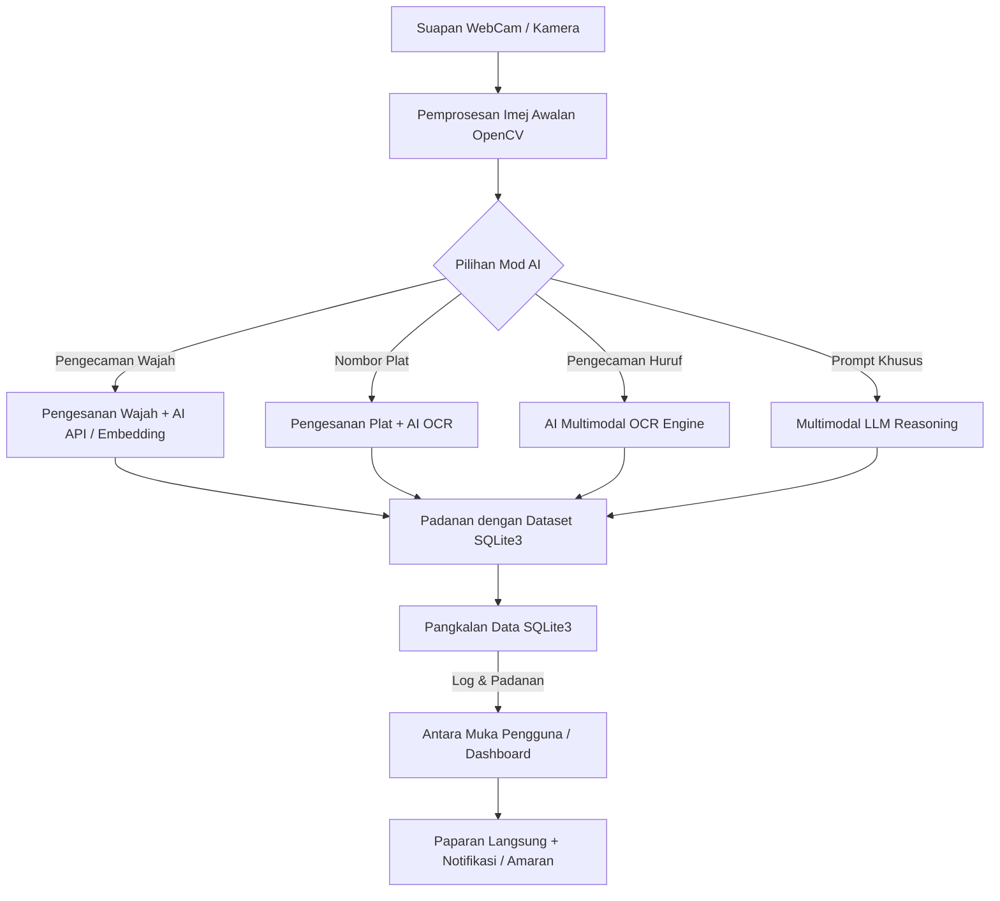

# 🎥 AI-WebCam: Kit Penyelidikan Penglihatan Komputer & AI Vision

Projek penyelidikan modular sumber terbuka (open-source) yang membolehkan penyelidik dan pembangun menyambungkan suapan kamera web (webcam) kepada pelbagai model AI Vision menggunakan **kunci API (API Key) sendiri** serta menguruskan **set data tempatan (SQLite3)** bagi tujuan pengecaman huruf (OCR), pengesanan wajah, nombor plat kenderaan (ANPR), dan pelbagai analisis visual lain.

> 🌐 **Laman Web Interaktif & Simulator Pembelajaran:**
> Kami telah menyediakan laman web interaktif lengkap dengan simulator animasi dan visualisasi mesra pelajar di dalam folder [`docs/`](docs/). Anda boleh membuka fail [`docs/index.html`](docs/index.html) di mana-mana pelayar web (Chrome / Edge / Firefox) atau hoskannya di GitHub Pages untuk melihat demonstrasi animasi cara sistem ini berfungsi secara visual!

---

## 📌 Objektif Projek

1. **Uji Kaji & Penyelidikan Persendirian (BYOK - Bring Your Own Key):** Membolehkan setiap pengguna menggunakan API Key AI masing-masing (Google Gemini, OpenAI GPT-4o, Anthropic Claude, atau model tempatan) tanpa perkongsian kunci.
2. **Pangkalan Data Tempatan (SQLite3):** Menyimpan senarai pemantauan (*watchlist*), data rujukan wajah, senarai plat kenderaan berdaftar, tetapan kunci API, dan log aktiviti secara terus di dalam komputer peribadi pengguna.
3. **Mudah Disesuaikan (Modular):** Mudah untuk menukar tugas penglihatan AI mengikut keperluan penyelidikan tanpa perlu mereka semula keseluruhan sistem.

---

## ✨ Ciri-Ciri Utama (Core Features)

### 1. 🔑 Pengurusan Kunci AI API (BYOK)
- Sokongan untuk pelbagai penyedia perkhidmatan AI Multimodal:
  - **Google Gemini API** (cth: Gemini 1.5 Flash / Pro)
  - **OpenAI API** (cth: GPT-4o / GPT-4o-mini)
  - **Anthropic Claude API** (cth: Claude 3.5 Sonnet)
  - **Ollama / Local Vision Model** (Pilihan luar talian seperti LLaVA / Moondream untuk privasi penuh)
- Kunci API disimpan secara setempat dalam fail konfigurasi selamat atau pangkalan data SQLite yang disulitkan (*encrypted*).

### 2. 🎯 Mod Tugas AI Vision (Modular Tasks)
* **Pengecaman Wajah (Face Recognition):**
  - Mengesan wajah dari suapan video.
  - Membandingkan wajah dikesan dengan senarai wajah dalam pangkalan data (Dibenarkan / VIP / Amaran / Tidak Dikenali).
* **Pengecaman Nombor Plat Kenderaan (ANPR - Automatic Number Plate Recognition):**
  - Mengesan plat lesen kereta / motosikal.
  - Membaca teks plat dan memadankannya dengan senarai putih (*whitelist*) atau senarai hitam (*blacklist*) di SQLite3.
* **Pengecaman Huruf & Teks (OCR - Optical Character Recognition):**
  - Membaca dokumen, resit, tanda arah, atau teks fizikal di hadapan kamera.
* **Pemerhatian & Ringkasan Am (General Scene Analysis):**
  - Menjana huraian aktiviti dalam bilik atau ruang kerja menggunakan arahan teks (*prompt*) tersuai kepada model AI.
* **Analisis Pergerakan Sukan & Biomekanik Tinju (Sports & Boxing Biomechanics):** *(Baru)*
  - **Sukan Olahraga & Larian:** Menganalisis ayunan kaki, panjang langkah (stride), postur torso condong, dan pergerakan tangan menggunakan **MediaPipe Pose Estimation**.
  - **Biomekanik Sukan Tinju (Boxing Analysis):**
    - **Aturan Tumbukan (Punches):** Analisis ekstensi siku penuh, putaran buku lima (knuckle rotation), dan recoil/snap pantas untuk Jab, Cross, Hook, dan Uppercut.
    - **Kedudukan Kaki & Pendirian (Footwork & Stance):** Pengecaman automatik *Orthodox* vs *Southpaw*, nisbah lebar tapak kaki vs bahu (1.2x - 1.5x), fleksi lutut, dan kedudukan tumit belakang.
    - **Kawalan Guard & Bunga Pertahanan:** Pemantauan kedudukan penumbuk menutup dagu dan pipi (*High Guard*), serta siku menutupi rusuk (*rib protection*).
    - **Disiplin Kombinasi & Rantaian Kinetik:** Mengesan turutan tumbukan yang betul (1-2 Jab-Cross, 1-2-3), putaran pinggul, dan perlindungan tangan bertahan ketika menumbuk.
  - Menjana diagnosis kelajuan, skor postur, pengesanan kelemahan teknikal, dan cadangan dril latihan khusus peninju/atlet.
  - Output: Papan Pemuka Studio Sukan interaktif dengan tolok sudut sendi secara langsung dan simpanan rekod sesi ke pangkalan data SQLite.


### 3. 📂 Pengurusan Set Data & Senarai Pantau (Dataset & Watchlist)
- Antara muka mesra pengguna untuk memasukkan data rujukan:
  - Muat naik gambar rujukan wajah berserta nama & maklumat individu.
  - Masukkan senarai nombor pendaftaran kenderaan berserta status (cth: Staf, Pelawat, Dilarang).
- Eksport dan import data rujukan dalam format CSV atau JSON.

### 4. 📊 Log Aktiviti & Simpanan Imej Snapshot
- Merekodkan setiap pengesanan ke dalam SQLite3 (Tarikh, Masa, Jenis Tugas, Hasil Pengecaman, Tahap Keyakinan / *Confidence Score*).
- Menyimpan imej tangkapan (*snapshot*) yang memicu amaran ke dalam folder media tempatan.

---

## 🏗️ Seni Bina Sistem (Architecture)



---

## 🗄️ Skema Pangkalan Data Cadangan (SQLite3)

Fail pangkalan data tempatan: `data/ai_webcam.db`

1. **`api_settings`**:
   - `id` (INTEGER PRIMARY KEY)
   - `provider` (TEXT - cth: 'gemini', 'openai', 'claude', 'local')
   - `api_key` (TEXT)
   - `model_name` (TEXT)
   - `is_active` (BOOLEAN)

2. **`face_dataset`**:
   - `id` (INTEGER PRIMARY KEY)
   - `person_name` (TEXT)
   - `category` (TEXT - cth: 'VIP', 'Staf', 'Pelawat', 'Senarai Hitam')
   - `image_path` (TEXT)
   - `embedding_data` (BLOB / TEXT - untuk padanan pantas)
   - `created_at` (DATETIME)

3. **`vehicle_watchlist`**:
   - `id` (INTEGER PRIMARY KEY)
   - `plate_number` (TEXT UNIQUE)
   - `owner_name` (TEXT)
   - `status` (TEXT - cth: 'Dibenarkan', 'Dilarang', 'Perhatian')
   - `notes` (TEXT)
   - `created_at` (DATETIME)

4. **`detection_logs`**:
   - `id` (INTEGER PRIMARY KEY)
   - `task_type` (TEXT - 'FACE', 'ANPR', 'OCR', 'SCENE')
   - `detected_value` (TEXT)
   - `confidence` (REAL)
   - `matched_id` (INTEGER)
   - `snapshot_path` (TEXT)
   - `timestamp` (DATETIME)

---

## 📁 Cadangan Struktur Direktori Projek

```text
AI-WebCam/
├── README.md                  # Dokumentasi & panduan projek
├── requirements.txt           # Senarai pakej Python yang diperlukan
├── .env.example               # Contoh tetapan persekitaran (pilihan)
├── app.py                     # Titik masuk utama aplikasi (Dashboard / UI)
├── config.py                  # Konfigurasi aplikasi & pangkalan data
│
├── core/                      # Modul teras penglihatan & kamera
│   ├── __init__.py
│   ├── camera.py              # Pengendali perkakasan webcam (OpenCV)
│   └── database.py            # Pembina & pengurus pangkalan data SQLite3
│
├── ai_services/               # Integrasi API Pembekal AI
│   ├── __init__.py
│   ├── base_provider.py       # Kelas asas (Base AI Provider)
│   ├── gemini_service.py      # Google Gemini Vision integration
│   ├── openai_service.py      # OpenAI GPT-4o integration
│   └── local_service.py       # Sokongan model tempatan (cth: Ollama / Tesseract)
│
├── tasks/                     # Logik tugasan khusus
│   ├── __init__.py
│   ├── face_recognition.py    # Logik pengecaman wajah & padanan
│   ├── license_plate.py       # Logik nombor plat kenderaan
│   ├── ocr_reader.py          # Logik pengecaman huruf/teks
│   └── scene_analyzer.py      # Logik penganalisis situasi am
│
├── data/                      # Folder data tempatan
│   ├── ai_webcam.db           # Fail pangkalan data SQLite3
│   ├── snapshots/             # Tangkapan gambar daripada pengesanan
│   └── reference_faces/       # Gambar rujukan wajah untuk dataset
│
└── ui/                        # Antara muka pengguna (UI)
    ├── templates/             # HTML Templates (jika guna Web UI berasaskan Flask/FastAPI)
    └── static/                # CSS & JS untuk suapan langsung dan paparan moden
```

---

## 💻 Cadangan Teknologi

- **Bahasa Pengaturcaraan:** Python 3.10+
- **Pangkalan Data:** SQLite3 (Terbina dalam Python, tiada setup pelayan luaran diperlukan)
- **Pemprosesan Imej & Kamera:** OpenCV (`opencv-python`), Pillow (`PIL`)
- **Pilihan Antara Muka (UI):**
  - *Pilihan A (Disyorkan):* **Web Dashboard Ringan (FastAPI / Flask + Vanilla HTML/CSS/JS)** - Memaparkan *live video stream*, panel masukkan API Key, serta jadual data senarai kenderaan & wajah dengan reka bentuk moden dan responsif.
  - *Pilihan B:* **Streamlit** - Sangat cepat untuk prototaip penyelidikan data sains.
- **Penyedia AI:**
  - `google-genai` / `google-generativeai` (Gemini API)
  - `openai` (OpenAI API)
  - `requests` / `httpx` untuk penyambungan API fleksibel

---

## 🚀 Fasa Pembangunan (Roadmap)

- [ ] **Fasa 1: Asas Pangkalan Data & Pengendali Kamera**
  - Skrip pangkalan data SQLite3 (`core/database.py`).
  - Uji sambungan webcam dan tangkapan bingkai asas menggunakan OpenCV.
- [ ] **Fasa 2: Modul API Key & Pembekal AI (Gemini / OpenAI)**
  - Sistem pengurusan kunci API peribadi.
  - Fungsi menghantar bingkai gambar ke model AI Vision dan menerima respons JSON berstruktur.
- [ ] **Fasa 3: Pelaksanaan Tugas Khusus**
  - Pengecaman huruf (OCR).
  - Pengecaman nombor plat kenderaan + padanan dengan senarai SQLite.
  - Pengecaman wajah + padanan rujukan.
- [ ] **Fasa 4: Pembangunan Antara Muka Pengguna (UI Dashboard)**
  - Panel kawalan suapan langsung kamera.
  - Halaman menguruskan senarai nombor plat & set rujukan wajah.
  - Halaman sejarah log pengesanan.
- [ ] **Fasa 5: Ujian & Pengoptimuman**
  - Ujian kadar bingkai sesaat (FPS), kependaman API (*latency*), dan had panggilan API (*rate limit*).

---

## 🔒 Privasi & Keselamatan Data

- Semua data, imej tangkapan, dan kunci API kekal di dalam peranti anda sendiri (`localhost`).
- Fail `.gitignore` disediakan supaya kunci peribadi dan data pengesanan tidak dimuat naik ke repositori awam secara tidak sengaja.

---

## 📝 Lesen

Projek ini dibangunkan untuk tujuan penyelidikan, pendidikan, dan eksperimen persendirian.
